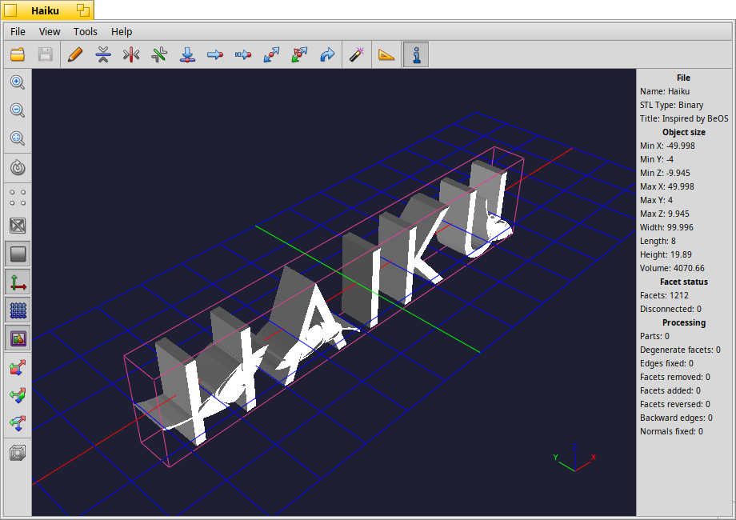

# STLover

 A Simple and Powerful STL 3D Model Viewer for [Haiku](https://haiku-os.org)

STLover is an intuitive 3D model viewer designed specifically for Haiku, for working with STL (stereolithography) files. It focuses on ease of use while providing powerful tools for visualization, analysis, and basic editing of 3D models. The application is suitable for a wide range of users: engineers, designers, 3D printing enthusiasts, and anyone who needs an effective tool for working with STL files.



## Dependencies
[ADMesh](https://admesh.readthedocs.io/en/latest/) - C library for processing triangulated solid meshes
```
pkgman install admesh_devel
```

## Building and installing
```
make
make bindcatalogs
```

STLover is also available from [HaikuDepot](https://depot.haiku-os.org/stlover).

## Adding translations
If you want to help out by adding more translations, please do so at [Polyglot](https://i18n.kacperkasper.pl/projects/45).
